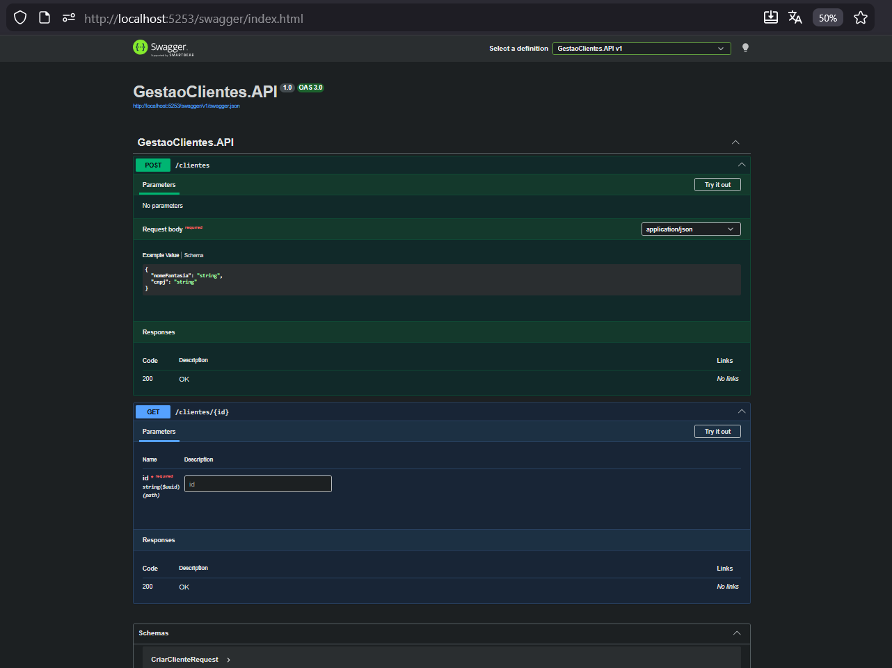
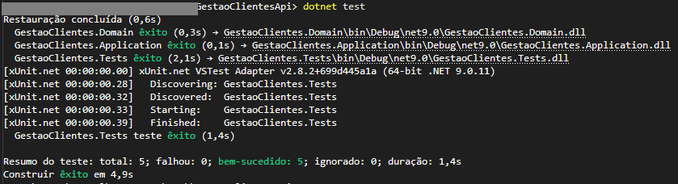
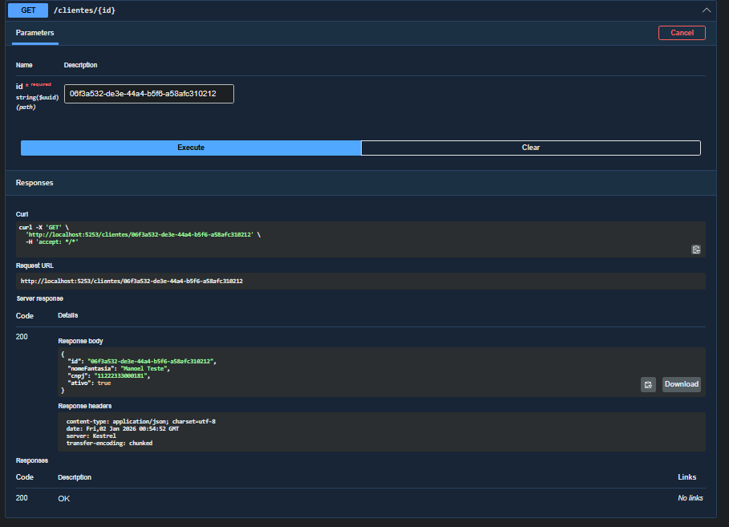
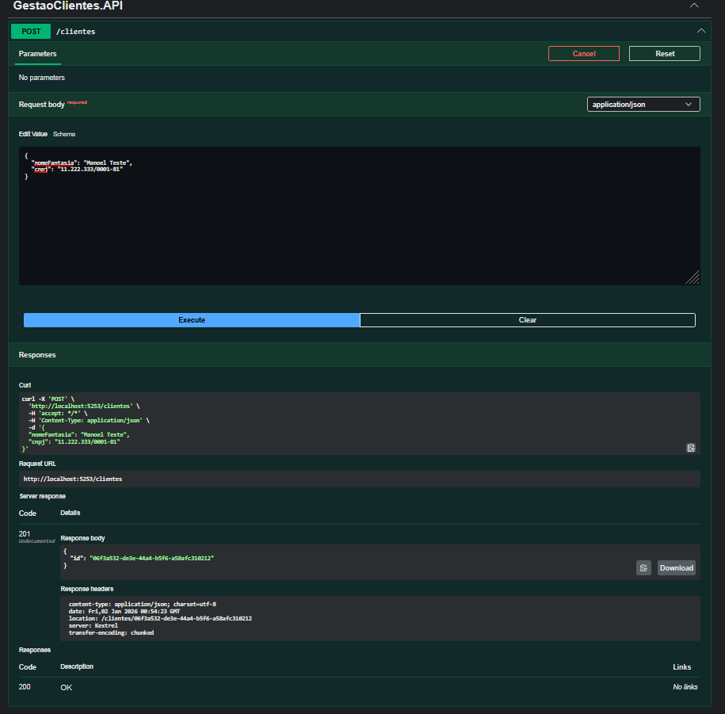
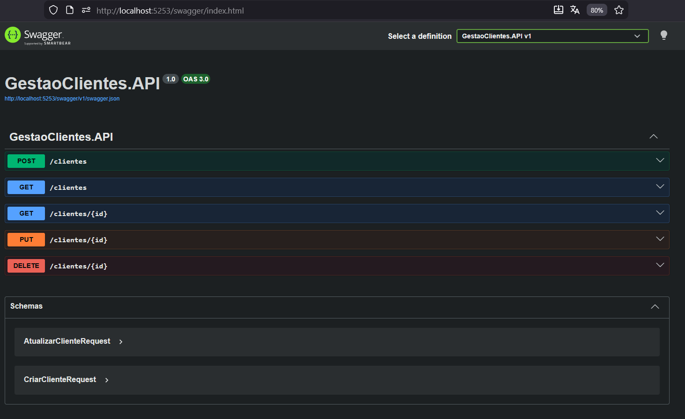
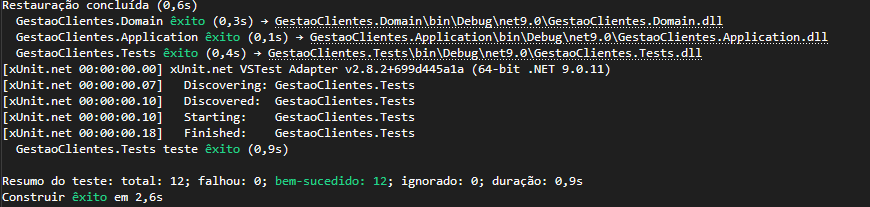

# 🚀 Gestão de Clientes API (Desafio) - .NET 9 + Clean Architecture + CQRS

Bem-vindo(a), sou o Manoel! 😄  
Este repositório contém uma API simples e funcional para **Cadastro e Consulta de Clientes**, construída em **.NET 9 (C# 13)** seguindo **Clean Architecture**, **CQRS** e boas práticas de organização e testes unitários, tudo de acordo com o desafio proposto!  
É legal, vai curtir (ou melhor, vai relembrar também...!

---

## 🎯 Objetivo do Desafio

Implementar uma **feature slice** (fatia vertical) com:

✅ **Criar um Cliente** (`POST /clientes`)  
✅ **Consultar um Cliente por ID** (`GET /clientes/{id}`)

Com foco em:

- 🧱 Arquitetura limpa (Clean Architecture)
- 🔁 Separação de responsabilidades (SOLID)
- 🧠 Modelagem de domínio (Entidade + Value Object)
- 🧪 Testes unitários (xUnit)
- 🧾 Commits e evolução organizada no Git

---

## 🧩 Regras de Negócio Implementadas

### 👤 Entidade `Cliente`
- Possui **Id**, **NomeFantasia**, **Cnpj** e **Ativo**
- Protege invariantes do domínio:
  - ✅ `NomeFantasia` não pode ser vazio

### 🧾 Value Object `Cnpj`
- É um **Value Object**
- Valida:
  - ✅ 14 dígitos
  - ✅ não aceita sequência repetida (ex: 00000000000000)
  - ✅ valida dígitos verificadores (regra oficial)

---

## 🏗️ Arquitetura do Projeto (Clean Architecture)

> Regra de ouro: **dependências apontam para dentro** 🧠

📦 Estrutura de projetos:

- **GestaoClientes.Domain**  
  Regras de negócio e modelos do domínio (`Cliente`, `Cnpj`).

- **GestaoClientes.Application**  
  Casos de uso (CQRS), contratos e Handlers.
  - `CriarClienteCommand` + `CriarClienteCommandHandler`
  - `ObterClientePorIdQuery` + `ObterClientePorIdQueryHandler`

- **GestaoClientes.Infrastructure**  
  Implementações técnicas (detalhes).  
  - Repositório em memória `RepositorioClienteEmMemoria`

- **GestaoClientes.API**  
  Camada HTTP (Minimal API) expondo endpoints.

- **GestaoClientes.Tests**  
  Testes unitários (xUnit) focados na camada Application.

---

## 🧠 CQRS (Comandos e Consultas)

- ✍️ **Command**: altera estado
  - `CriarClienteCommand`

- 🔎 **Query**: apenas consulta
  - `ObterClientePorIdQuery`

📌 Cada operação tem seu **Handler** dedicado (preferi deixar alguns métodos com "handler" no nome).

---

## 💾 Persistência (In Memory)

A implementação atual usa um repositório **em memória**, suficiente para o desafio:

- ✅ rápido e simples
- ✅ permite validar arquitetura e padrão de repositório
- ✅ valida CNPJ único

> Observação: foi projetado para ser facilmente substituído por um banco real (ex: SQLite,...) no futuro. Pois nosso sistema é nada sem memória, correto?!

---

## 🖼️ Imagens do Projeto

As imagens estão na pasta:

📁 `ImgsAPI/`

Ela fica **no mesmo nível** das pastas na raiz do projeto.

Na primeira imagem, podemos ver a API com o GET e o POST via Swagger:

E no terminal, o retorno após o teste do código:

No Swagger, o exemplo do GET:

No Swagger, o exemplo do POST:

---

## 🧐 O que instalei e como rodar?

Além dos requisitos do sistema.  
Criei a solução (com o Git desde o início) e os projetos (new sln, new classlib, new webapi e new xunit), adicionei na solution (dotnet sln...) e as referências "para dentro" (dotnet add ... reference ...)  
Além do próprio Swagger, instalei usando o: *dotnet add .\GestaoClientes.API\GestaoClientes.API.csproj package Swashbuckle.AspNetCore*  
Rodar no terminal: *dotnet run --project .\GestaoClientes.API*  
E veremos algo como: "Now listening on: http://localhost:5253"  
Como temos o Swagger, só acrescentar e colar no navegador: `http://localhost:5253/swagger/index.html`

---

## 🆙 Extras (para fechar o ciclo!)

Acrescentei também os métodos HTTP:

✅ **Atualizar um Cliente** (`PUT /clientes/{id}`)  
✅ **Deletar um Cliente** (`DELETE /clientes/{id}`)  
✅ **Consultar os Clientes** (`GET /clientes`) 
OBS: Os parâmetros do GET /clientes consite em Páginação (não seria bom em um futuro ter problemas com o processamento da consulta), tamanho Página, se está ativo ou não e o nome, sendo os dois últimos opcionais mas de uso sempre bom se possível.

## No CQRS (Comandos e Consultas) ainda mantemos a lógica:

- ✍️ **Command**: altera estado, acrescentando:
  -  `AtualizarClienteCommand`
  - `DeletarClienteCommand`

- 🔎 **Query**: apenas consulta, acrescentando:
  - `ListarClientes`
 

Na imagem abaixo, podemos ver a API com todos os métodos via Swagger:

E no terminal, o retorno após o teste do código completo, acrescentando também testes para meus novos métodos:

---

